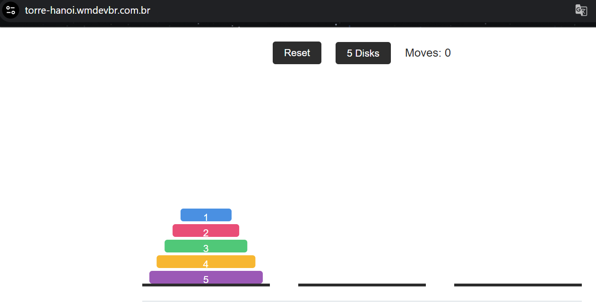

# 🗼 Torre de Hanoi - React App

Este é um projeto desenvolvido em **React.js** que simula o clássico jogo **Torre de Hanoi**, com uma interface amigável, responsiva e personalizável. O objetivo principal é permitir a escolha do número de discos (3 a 5) e mover todos eles de uma torre para outra, respeitando as regras do jogo.

## 🎯 Objetivo

- Simular o jogo Torre de Hanoi com interface interativa.
- Estimular o raciocínio lógico e resolução de problemas.
- Demonstrar conhecimentos de React, estados, componentes e estilização com CSS responsivo.

## 🕹️ Como jogar

1. Selecione a quantidade de discos no seletor (3, 4 ou 5).
2. Clique em uma torre para selecionar o disco do topo.
3. Clique em outra torre para movê-lo.
4. O objetivo é mover todos os discos para a última torre, respeitando as regras:
   - Só é possível mover um disco por vez.
   - Um disco maior **nunca** pode ficar sobre um menor.

## 🚀 Tecnologias usadas

- **React.js** (com hooks)
- **JavaScript**
- **HTML & CSS** responsivo
- **Vite** ou **Create React App** (dependendo de como você iniciou)

## 📂 Estrutura do Projeto

    src/ 
    ├── App.jsx 
    ├── App.css 
    ├── components/ 
    │ ├── AdBanner.jsx 
    │ └── Footer.jsx └── assets/

## 📸 Aplicação

> 

Para acessar [clique aqui.](https://torre-hanoi.wmdevbr.com.br/)

## 📦 Instalação

    ```bash
        git clone https://github.com/MetzkerDeveloper/tower-of-hanoi.git
        cd tower-of-hanoi
        npm install
        npm run dev
    ```


## 🧠 Desafios Técnicos
Lógica para movimentação dos discos com validação.

Responsividade total para mobile, tablet e desktop.

Feedback visual ao selecionar discos e ao vencer o jogo.

## 👨‍💻 Desenvolvedor
Desenvolvido por Waleriano Metzker Magalhães

📧 Email: walerianoadm@gmail.com

📱 Instagram: [@wm_magalhaes](https://www.instagram.com/wm_magalhaes/)
  
[](https://www.linkedin.com/in/waleriano-magalh%C3%A3es-84b39219b/)

🌐 Portfólio: https://waleriano-magalhaes.wmdevbr.com.br

